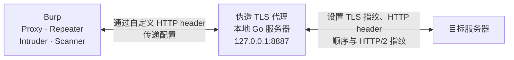
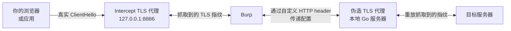

# Awesome TLS — Burp Suite TLS 指纹伪造扩展

**仓库：** [Robin528919/burp-awesome-tls-plus](https://github.com/Robin528919/burp-awesome-tls-plus) · **文档站：** [robin528919.github.io/burp-awesome-tls-plus](https://robin528919.github.io/burp-awesome-tls-plus/) · [English](./README.md) | **简体中文**

[](https://github.com/Robin528919/burp-awesome-tls-plus/releases)
[](./LICENSE)
[](https://github.com/Robin528919/burp-awesome-tls-plus/releases)
[](https://portswigger.net/burp)
[](./llms.txt)

> **最近更新：** 2026-08-07 · **最新版本：** [v2.3.1](https://github.com/Robin528919/burp-awesome-tls-plus/releases/tag/v2.3.1)  
> **本项目是 [sleeyax/burp-awesome-tls](https://github.com/sleeyax/burp-awesome-tls) 的 fork。**
> 原始扩展的设计、Go/JNA 架构，以及本项目所依赖的绝大部分代码，都出自
> [@sleeyax](https://github.com/sleeyax) 及其贡献者之手。
> 本 fork（**burp-awesome-tls-plus**）在其基础上继续开发，详见[本 fork 新增的功能](#本-fork-新增的功能)
> 与[与上游对比](./docs/comparison.md)。
> 遵循与上游相同的 GPL v3 协议。

## 什么是 Awesome TLS？

**Awesome TLS**（本仓库名：**burp-awesome-tls-plus**）是一款 [Burp Suite](https://portswigger.net/burp) 扩展，用于伪造浏览器 TLS 指纹（JA3 / JA4 / ClientHello）。Burp 外发流量使用接近真实浏览器的 ClientHello，而不再暴露 Java 默认 TLS 栈特征。

安全研究人员与渗透测试人员在 Cloudflare、PerimeterX、Akamai、DataDome 等 WAF / 机器人检测拦截 Burp 时使用它。伪造范围覆盖 **所有 Burp 工具** —— Proxy、Repeater、Intruder、Scanner，以及其他扩展发出的请求；只有 Burp 自身的内部流量被有意跳过。实现上经 JNA 将请求路由到本地 Go TLS 栈（[utls](https://github.com/refraction-networking/utls) / [tls-client](https://github.com/bogdanfinn/tls-client)），不使用反射，也不 fork Burp Community 源码。

### 一览

| 指标 | 数值（本 fork） |
| --- | --- |
| 命名 TLS 指纹配置 | **80**（`default` + [tls-client `MappedTLSClients`](https://github.com/bogdanfinn/tls-client) 中的 79 项） |
| 覆盖的 Burp 工具 | **全部** — Proxy、Repeater、Intruder、Scanner 以及其他扩展；只跳过 Burp 自身的内部流量 |
| 预构建 OS/架构 | **8** — macOS ×2、Linux ×4、Windows ×2（另有 fat jar） |
| 域名规则 | 精确主机 + `*.后缀`；最具体规则优先 |
| 配置存储 | Burp 工程外的可共享 `rules.json` |

| 需求 | 本扩展的做法 |
| --- | --- |
| Burp 被识别为 Java TLS / 机器人流量 | 伪造 Chrome、Firefox、Safari、移动端或自定义 ClientHello |
| 全局一个指纹不够用 | **按域名规则**（精确主机或 `*.后缀`），全局配置作兜底 |
| 只想改 Proxy | 覆盖 **全部工具**：Proxy、Repeater、Intruder、Scanner 以及其他扩展 |
| Cloudflare bot score 偏低 | 改善 TLS/HTTP2 指纹对齐（见[效果展示](#效果展示)） |


**快速导航：** [安装](#安装) · [配置](#配置) · [工作原理](#工作原理) · [常见问题](#常见问题-faq) · [与上游对比](./docs/comparison.md) · [Releases](https://github.com/Robin528919/burp-awesome-tls-plus/releases) · [AI 摘要（llms.txt）](./llms.txt) · [English](./README.md)

---

## 本 fork 新增的功能

| | 上游（`sleeyax/burp-awesome-tls`） | 本 fork（`burp-awesome-tls-plus`） |
| --- | --- | --- |
| 指纹作用范围 | 只有一个全局设置 | 按域名配置规则，全局设置作为兜底 |
| 覆盖的工具 | 仅 Proxy | 全部工具 —— Proxy、Repeater、Intruder、Scanner 以及其他扩展 |
| 规则存储 | — | 存为 Burp 工程之外的 JSON 文件：可手工编辑、可 diff、可共享 |
| 保存方式 | 手动，且分标签页 | 规则自动保存；支持导入导出，方便在多台机器间迁移 |
| AI 访问 | — | 可选的本地 MCP 端点，AI 客户端可以读取设置并提交修改提议，但永远无法自己应用 |

同时修复了上游的两个问题：两个 `Save all settings` 按钮各自只保存所属标签页，导致改了两个标签页却只从一处保存时，另一处的修改被静默丢弃；以及处理失败的请求会被直接丢弃而不是原样放行。

设置界面重写为手写 Swing，并通过 Burp 自身的 `applyThemeToComponent` 应用主题。被替换掉的 IntelliJ GUI designer form 从未接入 Gradle 构建，只能在 IDE 内重新生成。

---

## AI Control（可选，默认关闭）

**AI Control** 标签页会在本机开一个 [MCP](https://modelcontextprotocol.io) 端点，让 AI 客户端
（Codex Desktop、Codex CLI）读取 Awesome TLS 的设置并提交修改提议。对外只有两个工具：

| 工具 | 作用 |
| --- | --- |
| `awesome_tls.settings.inspect` | 返回已提交的设置、生效的域名规则、指纹列表、各监听器的真实状态，以及（可选）某个主机实际会用到的完整传输配置。只读，不做 DNS 解析，也不向目标发任何流量。 |
| `awesome_tls.settings.propose` | 校验一次修改并记录下来等待审批，本身不改任何设置。 |

**应用、拒绝、撤销都是 Burp 界面上的操作。** 没有任何工具可以应用提议。默认情况下提议会等你审批；
标签页里另有一个 **auto-apply** 开关（默认关闭、不记忆、每次开启都要二次确认），开启后校验通过的改动
会立即生效——在反复调指纹、每轮都要点一下才是瓶颈时很有用。开启它意味着本机任何进程都能无提示改你的设置，
确认框会把这点说清楚。两种模式下其余环节都不变：校验、审计、以及 **Revert last AI apply**。
提议会展示逐字段的完整 diff、每项改动影响什么以及何时生效；对可能让整套环境失联的改动
——监听地址、上游代理、全局指纹、删除规则——还会要求二次确认。

### 启用前请先读这段

端点只绑定 `127.0.0.1`，并且**完全没有任何认证**。这是有意接受的权衡，不是疏漏，它意味着：

- 本机上以你的身份运行的任何进程，都能通过它读到**完整设置，包括外部代理凭据和完整的 hex ClientHello**；
- 这类进程都可以提交一份等你审批的提议；
- 绑定回环地址并不等于认证——正因如此，每次启用都会显示这段警告，并且需要你勾选确认已经读过。

勾选会被记住：被确认的是端点的属性，不是当天会话的属性。启用不会被记住——它只对当前 Burp 会话有效，重启后不会自动恢复。

### 使用方式

1. 打开 **Awesome TLS → AI Control**，选择端口（默认 `8885`），勾选确认（只需第一次）后点 **Enable**。
2. 把端点注册进你的客户端。标签页里的 **Connect a client** 一栏会按你实际选的端口，直接复制好命令：

   ```sh
   claude mcp add --transport http --scope user awesome-tls http://127.0.0.1:8885/mcp
   ```

   ```sh
   codex mcp add awesome-tls --url http://127.0.0.1:8885/mcp
   ```

   需要手工配置的客户端，用同样内容的 JSON：

   ```json
   {
     "mcpServers": {
       "awesome-tls": {
         "type": "http",
         "url": "http://127.0.0.1:8885/mcp"
       }
     }
   }
   ```

   这两条命令都是**全局注册**，对所有项目生效。去掉 `--scope user` 则只对当前项目生效。
   全局注册意味着：只要你在 Burp 里启用了这个端点，任何会话的客户端都能连上它。
3. 可选：装上配套的 **skill**。注册端点只告诉客户端「有两个工具」，而指纹和 hex ClientHello 谁压谁、
   提议必须带哪些 acknowledgement、真实 ClientHello 怎么抓出来，都要靠这份 skill。标签页里同样有
   一键复制：

   ```sh
   mkdir -p ~/.claude/skills/awesome-tls-mcp && curl -fsSL -o ~/.claude/skills/awesome-tls-mcp/SKILL.md https://raw.githubusercontent.com/Robin528919/burp-awesome-tls-plus/main/skills/awesome-tls-mcp/SKILL.md
   ```

   ```sh
   mkdir -p ~/.codex && curl -fsSL https://raw.githubusercontent.com/Robin528919/burp-awesome-tls-plus/main/skills/awesome-tls-mcp/SKILL.md >> ~/.codex/AGENTS.md
   ```

   skill 是 Claude Code 的机制，Codex 读的是纯指令文件，所以同一份内容直接追加进它的 `AGENTS.md`，
   而不是再维护第二份文档。第二条命令跑两次会追加两份，要更新请先删掉旧的那一节。装不装都可以，
   它不会改变 Burp 里的任何行为，原文见
   [`skills/awesome-tls-mcp/SKILL.md`](https://github.com/Robin528919/burp-awesome-tls-plus/blob/main/skills/awesome-tls-mcp/SKILL.md)。
4. 有提议到达时，标签页上会出现一个圆点。它不会抢焦点，也不会自动弹窗。
5. 看完 diff 后点 **Apply** 或 **Reject**。**Revert last AI apply** 可以撤销最近一次已应用的改动，
   直到有任何新的提交为止。

### 完整审计

默认关闭。开启后，每一次调用、提议、审批和设置变更都会带着完整取值记录到 `rules.json` 同目录下的
`audit/`。由此有两点后果：审计文件是**明文、未加密**的，任何能访问该目录的程序都能读；以及开启期间，
写不进审计的操作就不会发生——审计写入失败的设置变更会被拒绝，而不是不留记录地应用。

设计本身以及每项决策的理由见
[ADR-0001](docs/decisions/0001-ai-settings-control-via-embedded-mcp.md)。

---

## 赞助

> 原项目的持续维护离不开各位贡献者和赞助者。
> 如果你愿意赞助**上游项目**，请点击[这里](https://github.com/sponsors/sleeyax)。💖

---

## 效果展示

[CloudFlare bot score](https://cloudflare.manfredi.io/en/tools/connection)：


这只是其中一个例子。如果你在其他专业的机器人检测站点上做过测试，欢迎反馈结果。

## 工作原理

Burp 的 API 对这类高级用法支持相当有限，因此实现上做了一些取巧。

当一个请求进来时，扩展会拦截它，并转发给扩展加载时在后台启动的本地 HTTPS
服务器。所有 Burp 工具的流量都会走这条路径 —— Proxy、Repeater、Intruder、Scanner 都能拿到伪造的指纹，其他扩展发出的请求同样如此；Burp
自身的内部流量则不受影响。

这个本地服务器的作用类似代理：它把请求转发到真实目标，同时保留原始的请求头顺序，并应用可自定义的 TLS 配置。随后再把响应回传给 Burp。

配置项以及目标服务器地址、协议等必要信息，是通过一个特殊的 magic header **逐请求**传给本地服务器的。该 header
在转发到真实目标之前会被剥离。



> :information_source: 另一种思路是实现一个上游代理服务器再让 Burp 连过去，但原作者出于自定义能力和便携性的考虑选择了扩展的形式。

## 安装

1. 从 **[本 fork 的 Releases](https://github.com/Robin528919/burp-awesome-tls-plus/releases)** 下载对应操作系统的 jar（当前为 v2.3.1）。也可下载 fat jar，适用于全部支持平台，便于 U 盘跨平台使用。
   上游构建产物：[sleeyax/burp-awesome-tls/releases](https://github.com/sleeyax/burp-awesome-tls/releases)。
2. 打开 Burp（Pro 或 Community）→ **Extensions → Installed → Add** → 类型选 **Java** → 选择 jar → **Next**，应能无报错加载。
3. 打开 **Awesome TLS** 标签页，选择指纹（或配置域名规则），即可让 Proxy / Repeater / Intruder / Scanner 的流量带上伪造指纹。

## 配置

扩展基本是即插即用的。将鼠标悬停在 'Awesome TLS' 标签页的任意字段上，可以看到该字段的说明。

如果要从 WireShark 导入自定义的 Client Hello，把 client hello record 复制为 hex stream，粘贴到 "Hex Client Hello"
字段即可。


三个标签页的分工：

| 标签页 | 作用 |
| --- | --- |
| **Defaults** | 全局默认值。没有命中任何域名规则的请求使用它；也是规则中留空字段的继承来源 |
| **Domain rules** | 按域名覆盖配置。留空的单元格继承 Defaults |
| **Advanced** | 抓取客户端的**真实** TLS 指纹并复用。该功能为全局设置，无法按域名区分 |

### 按域名配置指纹

'Domain rules' 标签页让你为不同目标使用不同的指纹，而不再受限于单一的全局设置。
每条规则匹配精确主机名（`example.com`）或其子域（`*.example.com`），并可以独立覆盖指纹、hex ClientHello、外部代理和超时。留空的单元格会继承
'Defaults' 标签页的值。

当多条规则都能匹配时，最具体的那条生效：精确主机名优先于通配符，更长的通配符后缀优先于更短的。**行的先后顺序不影响结果。**


规则会在编辑后自动保存 —— 无需为它们点击 'Save settings'。规则以纯 JSON 形式保存在 Burp
工程之外，因此切换工程后依然存在，并且可以手工编辑、纳入版本管理或与团队共享：

| 操作系统 | 路径 |
| --- | --- |
| macOS | `~/Library/Application Support/burp-awesome-tls-plus/rules.json` |
| Linux | `$XDG_CONFIG_HOME/burp-awesome-tls-plus/rules.json`（或 `~/.config/...`） |
| Windows | `%AppData%\burp-awesome-tls-plus\rules.json` |

> :information_source: `-plus` 改名之前的版本用的目录是 `burp-awesome-tls`。首次启动时规则文件与 CA 证书都会自动搬到新目录，因此升级不会丢失规则，也不需要让客户端重新信任新生成的 CA。

上一个版本始终会保留为同目录下的 `rules.json.bak`。使用 'Export…' 和 'Import…' 可以在机器之间迁移规则；导入时会询问是与现有规则合并还是整体替换。

> :information_source: 主机名规则填写不完整的行会被高亮标出，并在请求时直接忽略，因此可以放心留一行没写完而不会影响其他规则。

> :information_source: 'Advanced' 标签页的设置是全局的。本地服务器只运行一个共享的 intercept 代理，所以这些值无法按域名区分。

#### 指纹与 hex ClientHello 是成对生效的

同一行内同时填写 Fingerprint 和 Hex ClientHello 时，**hex 生效，Fingerprint 会被忽略**（Go 侧固定优先使用 hex）。

反过来，某一行只填了 Fingerprint 时，它会清除本应从 Defaults 继承的 hex ClientHello，而不是两者叠加。

界面上会直接标明这一点：单元格显示的是**实际生效的值** —— 正常颜色表示本行自己设置且生效，灰色表示继承自 Defaults 或未被使用。

> :warning: 'Fingerprint' 下拉框中的 `default` 是一个具体的指纹配置，与**留空**不是一回事。留空才表示"继承 Defaults"。

<details>
  <summary>进阶用法</summary>

在 'Advanced' 标签页中，可以启用一个额外的代理监听器，它会自动采用请求中的当前指纹：


启用后，流程变为：



> :warning: 该功能优先级最高。一旦启用并成功抓取到指纹，它会覆盖**所有**域名规则中的指纹设置。如果发现规则没有生效，请先确认此开关处于关闭状态。

</details>

## 手动构建

不需要特定的 IDE —— 设置界面是手写 Swing，只需要 JDK 和 Go 工具链。目标语言版本参见 [workflows](.github/workflows)。

1. 编译 `./src-go/` 下的 go 包。执行
   `cd ./src-go/server && go build -o ../../src/main/resources/{OS}-{ARCH}/{PREFIX}server.{EXT} -buildmode=c-shared ./cmd/main.go`，
   按下表填写你所在平台对应的那一行：

   | 平台 | `{OS}-{ARCH}` | 输出文件名 |
   | --- | --- | --- |
   | macOS x64 / arm64 | `darwin-x86-64` / `darwin-aarch64` | `libserver.dylib` |
   | Linux x86 / x64 / arm / arm64 | `linux-x86` / `linux-x86-64` / `linux-arm` / `linux-aarch64` | `server.so` |
   | Windows x86 / x64 | `win32-x86` / `win32-x86-64` | `server.dll` |

   > :warning: **只有 macOS 需要 `lib` 前缀。** JNA 在 macOS 上查找的是 `libserver.dylib`，若文件名为
   > `server.dylib`，扩展能载入 Burp 但随即抛出 `UnsatisfiedLinkError`。目录名用的是 JNA 的命名而非
   > `uname` 的输出，详见 [JNA 文档](https://github.com/java-native-access/jna/blob/master/www/GettingStarted.md)。

2. 用 Gradle wrapper 构建 jar：`./gradlew buildJar`。

完成后你会得到一个可在当前操作系统上配合 Burp 使用的 jar 文件（通常位于 `./build/libs`）。

跑检查用 `./gradlew checkAll`：它会执行全部自检、验证 inspect 与 propose 不做任何域名解析，
并用一个替身 Burp API 加载整个扩展。

## 常见问题 (FAQ)

### 什么是 Burp Suite TLS 指纹伪造扩展？

装入 Burp 的 Java 扩展，会改写外发请求的 TLS ClientHello（及相关 HTTP/2 特征），使远端看到类似浏览器的指纹，而不是 Burp 默认的 Java TLS 指纹。

### 什么是 burp-awesome-tls-plus？

**burp-awesome-tls-plus** 即本仓库：在 [sleeyax/burp-awesome-tls](https://github.com/sleeyax/burp-awesome-tls) 之上增加按域名规则与全工具覆盖。下载地址：[Releases](https://github.com/Robin528919/burp-awesome-tls-plus/releases)。

### 与上游 `sleeyax/burp-awesome-tls` 有何不同？

同一套 Go + JNA 架构。本 fork 增加：**按域名指纹规则**、**四个工具全覆盖**（不仅 Proxy）、自动保存的可共享 `rules.json`，以及 UI/主题修复。完整对照见 [docs/comparison.md](./docs/comparison.md)。

### 支持 Burp Community 吗？

支持。在 Extender / Extensions 中以 Java 扩展方式加载 jar 即可，与 Professional 相同。

### 内置多少种 TLS 指纹配置？

指纹列表共 **80** 项：内置 `default`，外加 tls-client `MappedTLSClients` 中的 **79** 个命名客户端（Chrome、Firefox、Safari、iOS、Android、OkHttp 等）。也可粘贴自定义 ClientHello hex。

### 能否按主机配置不同的 JA3 / TLS 指纹？

可以。使用 **Domain rules** 标签页：精确主机（`example.com`）或通配符（`*.example.com`）。留空字段继承 **Defaults**。匹配为「最具体优先」（精确 > 更长通配符 > 更短通配符），与行顺序无关。

### 对 Cloudflare、Akamai、DataDome、PerimeterX 有用吗？

改善这些系统使用的 **TLS / HTTP 指纹层**，但不保证 bot score 满分——Cookie、JS 挑战、IP 信誉仍有影响。可参考[效果展示](#效果展示)。

### 哪些 Burp 工具会走伪造指纹？

全部。扩展注册的是 `HttpHandler`，它能看到每一个外发请求：Proxy、Repeater、Intruder、Scanner，以及其他扩展发出的请求。唯一的例外是 Burp 自身的内部流量（更新检查、Collaborator 轮询等），这部分被有意放行，否则会被打断。

### 启用后如何验证指纹？

可用 [tls.peet.ws](https://tls.peet.ws/)、[tlsfingerprint.io](https://tlsfingerprint.io/)、[scrapfly HTTP/2 工具](https://scrapfly.io/web-scraping-tools/http2-fingerprint)，以及 [Cloudflare connection 演示](https://cloudflare.manfredi.io/en/tools/connection) 等公开检测站对比。

### AI 能修改我的 Burp 设置吗？

只有在你自己于 Burp 中逐条批准时才能。可选的 AI Control 端点允许 AI 客户端读取设置并提交提议；
应用、拒绝、撤销都是 Burp 界面上的操作，背后没有对应的工具。该端点默认关闭、只绑定回环地址、
且没有认证——具体含义见 [AI Control](#ai-control可选默认关闭)。

### 域名规则存在哪里？

存在 Burp 工程之外的 JSON 文件中：

| 操作系统 | 路径 |
| --- | --- |
| macOS | `~/Library/Application Support/burp-awesome-tls-plus/rules.json` |
| Linux | `$XDG_CONFIG_HOME/burp-awesome-tls-plus/rules.json`（或 `~/.config/...`） |
| Windows | `%AppData%\burp-awesome-tls-plus\rules.json` |

### 是否仅限授权安全测试？

是。仅可在你拥有或已获明确授权的目标上使用。WAF 相关技术须遵守法律与职业道德。

更多说明见 [docs/faq.md](./docs/faq.md)。机器可读项目摘要：[llms.txt](./llms.txt)。

## 致谢

首先，本项目 fork 自 [@sleeyax](https://github.com/sleeyax) 的
**[sleeyax/burp-awesome-tls](https://github.com/sleeyax/burp-awesome-tls)**
及其[贡献者们](https://github.com/sleeyax/burp-awesome-tls/graphs/contributors)。

整套方案都是他们设计并实现的：把 Burp 的流量导向本地 Go 服务器以绕开 Burp 自身 TLS 栈的思路、JNA 桥接、逐请求传递配置的
header、ClientHello 解析 —— 全部如此。本 fork 只是在这个基础上增加了一些功能。如果它对你有帮助，请去给原项目点 star
和赞助。

同时感谢以下仓库的维护者：

- [refraction-networking/utls](https://github.com/refraction-networking/utls)
- [bogdanfinn/tls-client](https://github.com/bogdanfinn/tls-client)

以及以下网站的创建者：

- https://tlsfingerprint.io/
- https://kawayiyi.com/tls
- https://tls.peet.ws/
- https://cloudflare.manfredi.io/en/tools/connection
- https://scrapfly.io/web-scraping-tools/http2-fingerprint

## 许可证

[GPL V3](./LICENSE)，继承自上游项目。

本仓库为 [sleeyax/burp-awesome-tls](https://github.com/sleeyax/burp-awesome-tls) 的修改版本。改动摘要见[本 fork 新增的功能](#本-fork-新增的功能)，完整记录见提交历史。

## 仓库信息

- **本仓库（burp-awesome-tls-plus）：** https://github.com/Robin528919/burp-awesome-tls-plus
- **下载 / Releases：** https://github.com/Robin528919/burp-awesome-tls-plus/releases
- **上游：** https://github.com/sleeyax/burp-awesome-tls
- **对比文档：** [docs/comparison.md](./docs/comparison.md)
